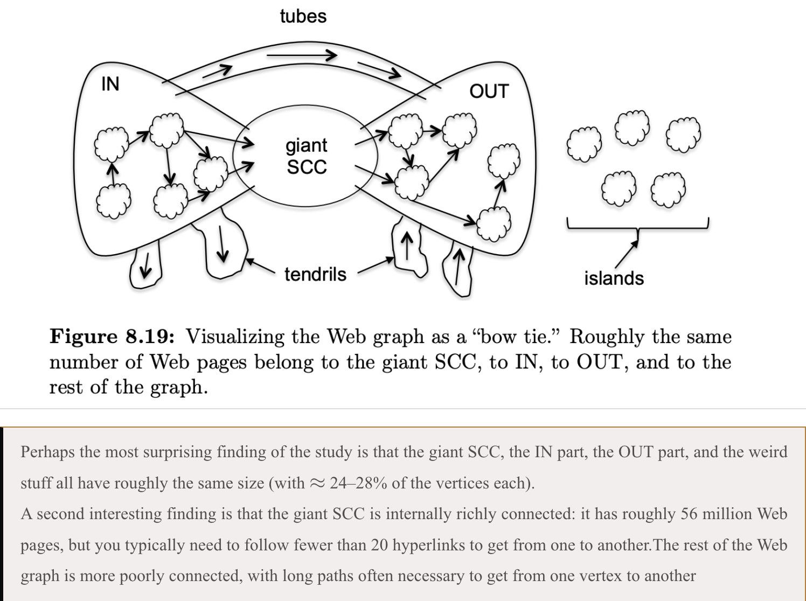

本项目的灵感来于

这张由Broder等人在2000年提出的著名“蝴蝶结”模型示意图，揭示了万维网宏观拓扑结构的核心特征：整个网络可被清晰地划分为一个巨大的强连通分量SCC、能够到达该核心的IN部分、被该核心到达的OUT部分，以及连接IN和OUT的“管道”和边缘的“卷须”与“孤岛”等部分；最令人惊奇的发现是，尽管功能不同，但这几个主要组成部分的规模却大致相当，各占总节点数的24%到28%，同时，尽管巨型强连通分量本身包含约5600万个网页，但其内部连接极其紧密，任意两个网页间通常只需不到20次点击即可相互到达，而网络的其他部分连通性则差很多。

这个蝴蝶结模型参与了以下的分析

- 网络鲁棒性：攻击SCC部分会对整个网络造成最大影响
- 传播特性：SCC是信息扩散的核心枢纽
- 网络优化：帮助理解节点的重要性和可达性

这种对网络结构的理解已扩展到社交网络、学术引用系统甚至金融网络分析中，成为识别系统脆弱性、预测信息流动和制定有效网络策略的基础框架。
如果对于一个特定的中国交通网络图同样能实现划分, 那么得到的成果对于我国交通网络的宏观分析与理解应该同样有着重要作用

一些假设(TODO: 对于别的网络分析, 此处的假设怎样进行更加合适):

- 为了得到一个比较合适的 "中国交通网络", 我采用的是起点和终点都在中国境内的飞机和铁路路线数据 -- 这样避免了图过于稠密, 也保证了交通网络图作为一个严格的有向图, 我使用 `main.py` 等相关代码实现
- 由于中国基建太过完善, 如果采用严格的 SCC, In, Out, Islands 定义(with `makeScc.py`), 那么最后得到的结果是: 400左右个城市, SCC包含了300多个, Make no sense!!!
  并且我本来想通过这个模型分析也主要是关注 SCC 与整个网络的鲁棒性的关系, 以及看看这样定义下的 "中国交通网络" 还有哪些 island, 所以现重新定义:
  - SCC: 出入总数大于 k 的城市
  - Island: 出入总数小于 m 的城市
  - 并且使用 `dealWith.py`, 获得该定义下的 SCC 和 Island 的 shapefiles
- 当 k 设置为某个值时, 得到的 SCC 中的任意一个城市破坏会导致整个网络的极大破坏(island 设置其实完全是出于对称性的考虑)

由于能力和时间的限制, 我只实现了 k=42, m=6 情况下的分析, 这是一个 TODO: 找到假设中的理想 k 值, 而之所以选择 k=42, m=6 这一组数据, 其实就是这样得到的 SCCs, Islands 的占比和之前蝴蝶结模型中得到的统计结论: 占比为 24% ~ 28%, 我对其实现了 2.5D 的可视化以及标准制图

结果在某些方面很神奇: 澳门竟然是我定义下的 island, 所以这里也有个 TODO: 数据来源是否可靠?

最后就是检查我的假设下, SCC 中的任意一个城市破坏是否会导致整个网络的极大破坏:

- 出于假设的一致性, 我们考虑任意破坏某一个城市, 检验破坏后的SCC(我的定义版本)减小个数, 以及比例
- 为了简单, 我们极端的认为某个城市被破坏, 即所有经过该城市的路线全部失效(全部都是飞机火车)

最后通过相应代码实现后发现, 确实基于上面的假设 失效比例都大于 30%, 可见得到的这些城市确实比较 "核心"

关于图片绘制, 三维设色地图, 采用变形较小的高斯克吕格投影
